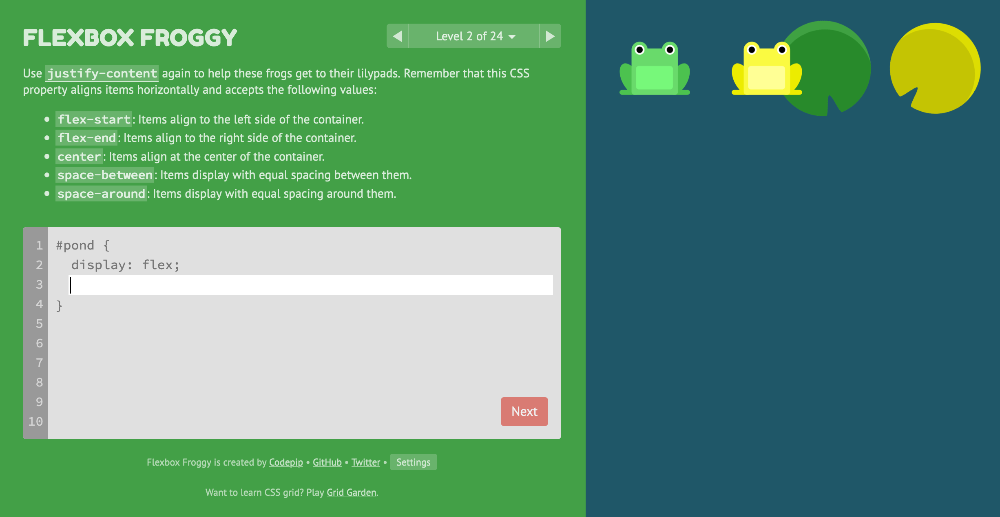
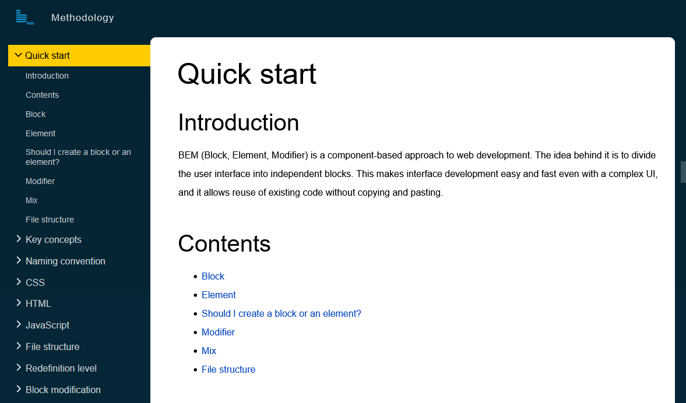
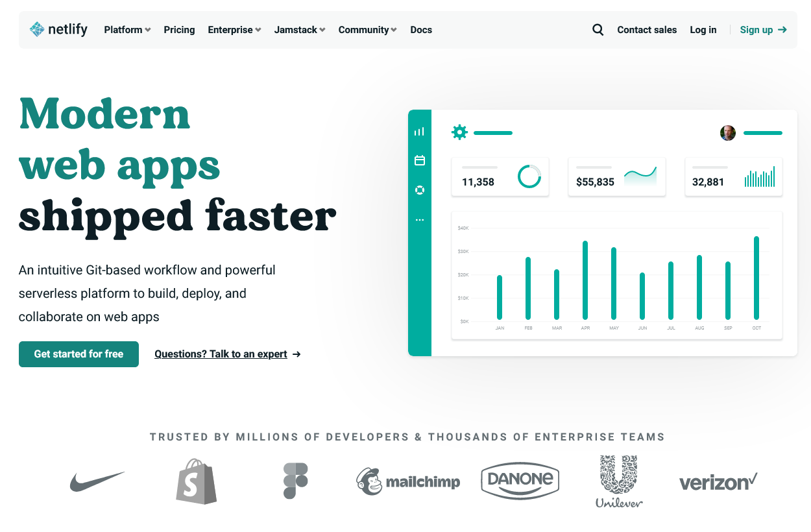

    

<h1 align="center">
  Web Fundamentals Part 2
</h1>

## Overview

[Video introduction](https://vimeo.com/532591211/b92d434ab5)

This week, as well as building on our HTML and CSS skills, we will be focusing on what we make and why we make it. It sounds obvious, but user facing software should be built with the user in mind. This means thinking about what the user is trying to do and how you can make that goal as easy possible for them to achieve. Learning how to communicate information, design natural flowing interactions and having the technical skills bring your ideas to life will set you apart from other junior developers. Usually, junior developers become so consumed with the technology they are using that they forget the bigger picture of why they are developing software. The world does not need more software, it needs more useful software.

So, for this week our focus will be practicing and mastering all of the basic foundations from last week, which will give us the freedom to implement user centered designs.

### This Week's Objectives

#### Learning:

1. Get confident with our coding environment: using Git, GitHub and VS Code.
2. Build and host our first website using HTML and CSS.
3. Confidently pair program, including reviewing each other's code and giving feedback.
4. Learn how to think carefully about user and client needs.

#### Mindset:

1. Understand why active learning is important.
2. Work effectively in pairs and teams.
3. Communicate and articulate our thought processes while programming.
4. Reflect on our daily progress.

## Learning Journey 🗺

The following tasks are for you to do in your own time, on your own and with your pair. They all will help you work towards meeting this week's objectives. Take your time, enjoy the process and read around each part.

### HTML and CSS Next Steps 👣

Now that we are comfortable with what HTML and CSS do, it's time for us to embed our skills. Read through [this handbook](https://www.freecodecamp.org/news/the-html-handbook/). It will serve as a great reference for everything HTML. Follow the W3 schools [HTML](https://www.w3schools.com/html/default.asp) and [CSS](https://www.w3schools.com/css/default.asp) introductions as well.

The best way to make sure these skills are second nature is to practice little and often. Here are some ideas that might help you get started, but feel free to build anything you like!

- Make yourself an HTML and CSS business card.
- Recreate a web page (you've done Google, try it with others!)
- Recreate a part of a web page (see a button you like? try and copy it exactly with HTML and CSS).
- Make a self portrait with CSS.
- Recreate a famous painting with CSS.
- Make up your own ideas!

### CSS: Flexbox 💪

Mastering layouts in CSS is a key skill for web design. There are many common layouts that you will see time and time again, but there's also room for creativity. Whether you're being super creative or implementing an age old classic, what you need is control over how your elements are laid out on the page. One way we could do this is to place all our elements at specific pixel positions. The problem with this technique is that we don't know how big our users' screens are. It could be Darren browsing on his 72 inch 4k smart TV or it could be Cindy on her smashed iPhone 5. It **could** be someone with exactly the same screen as you, but the point is we can never be sure.

There are a few options to overcome the problem of variable screen sizes. The old fashioned way is to use the table element that gives us a natural grid, and you will see this on older sites and in HTML for email. You can also use floats, but the two main modern ways for laying out elements on a page are Flexbox and Grid.

We will start this week by learning about Flexbox. There are a few concepts to learn, after which you'll have the freedom to lay things out in a powerfully responsive way.

- There is a [great course here](https://flexbox.io/) that that will guide you through all things Flexbox.
- Once you've understood the basics you can take a look at [this great reference article with diagrams](https://css-tricks.com/snippets/css/a-guide-to-flexbox/).
- To have a bit of fun and 'flex' your skills, play this game called [Flexbox Froggy](https://flexboxfroggy.com/).

Now that you can use Flexbox, have a go at implementing it in some of your practice sites and use it in your checkpoint challenge!

### Clean Code and Naming Conventions

OK, so you've made a website. You add a page. You add another page. You add three more pages. But what's this? You go back to change something on the first page and you get stuck. The code's a mess: it started small but has quickly spiraled out of control as you add this and that in a slapdash fashion. This is what will happen **if** you don't stick to a pattern (or convention) to help you write clean code. It's important to write clean code not just for your future self, but also for your colleagues and the person who has to maintain the code if you get hit by a bus. There is a saying amongst developers: 'you should always write code as if the person who next has to read it is a violent psychopath who knows where you live' (or as Tao some people call him).

We could come up with a convention ourselves, and this is not a bad idea as long as we stick to it. However, writing clean maintainable code is such a common problem that clever people have already put a lot of time into creating good patterns. Let's use that to our advantage.

**Introducing BEM 🧱🔥🛠**

BEM stands for Block Element Modifier. It is a naming convention to help us write nice clean HTML and CSS code. It's not super complicated, but the hard part is maintaining discipline as you code. Just remember: we know where you live.

Read through [this quick-start guide](https://en.bem.info/methodology/quick-start/) for an overview of what BEM is. Read more thoughts about BEM in [this css-tricks article](https://css-tricks.com/bem-101/) and then apply the BEM naming convention to your code. In the long run sticking to a pattern will save you **A LOT** of time and stress. Keep it clean folks!

### User Centered Design 🛠😳🛠

This week we are ensuring we keep the user front and center in our approach to designing and building web experiences. [This article and video](https://www.interaction-design.org/literature/topics/user-centered-design) gives a great introduction into what a user centered design process looks like. [This article](https://www.smashingmagazine.com/2008/01/10-principles-of-effective-web-design/) gives a more specific look at how users interact with web pages.

When working on your checkpoint challenge, use what you've learnt about user centered design in your approach.

### Design Fundamentals 📐

No matter how much CSS skill you have, if you don't know what you want the a page to look like then you still won't make websites which anyone wants to look at. This is where design principles come into play. The amount of white space, measuring line spacing and the alignment of different blocks are all easy things to manipulate with CSS. Get these values right and your site will look professional, get them wrong and your site will look amateur.

This [tutorial](https://scrimba.com/learn/design) does and excellent job of taking you through UI design fundamentals.

### Continuous Deployment ☁️👽

Now that we can build awesome websites, wouldn't it be good if the world could see it?

Netlify is a service that allows us to set up continuous deployment for our projects. This means that anytime we push changes to a GitHub repo, the site will update! Follow [this guide](https://www.netlify.com/blog/2016/10/27/a-step-by-step-guide-deploying-a-static-site-or-single-page-app/) to get your sites continuously deployed and hosted on [Netlify](https://www.netlify.com/).

## Groups and Pairs 👩‍💻👨‍💻 👩‍💻👨‍💻

Below you will find the pairs and teams for this week. Your pair will be the person you see the most but keep in touch with your team throughout the week. Ask them how they are getting on and use them as your first port of call if you are stuck on something.

## Pairs for Weeks 1 and 2

Click here to see pairs

| Pair | Team |                                             |
| ---- | ---- | ------------------------------------------- |
| 1    | A    | Tom Walker & Gurmukh Chandan                |
| 2    | A    | Rebecca Floyd & Sara Mohamoud               |
| 3    | B    | Sellanni McKenzie & Jamie Hannah            |
| 4    | B    | Amina Muhammad & Toby Smith                 |
| 5    | C    | Rumaanah Ellahi & Emilio Comiling           |
| 6    | C    | Lewis Murray & Catherine Butler             |
| 7    | D    | Kate Harrison & Alina Savin                 |
| 8    | D    | Becks Maybury & Nancy Echefu                |
| 9    | E    | Kelly Ryan & Muna Fidow                     |
| 10   | E    | Wiktor Nowicki & Merlin Jones               |
| 11   | F    | Helena Archer & Jack Browne                 |
| 12   | F    | Maryam Dar & Yonis Elmi                     |
| 13   | G    | Clarisse Leduc & Jubair Ahmed               |
| 14   | G    | Natalie Pinnock & Ines Perez                |
| 15   | H    | Rachel Haynes & Umar Begg                   |
| 16   | H    | Asfand Khan & Amdadur Rahman                |
| 17   | I    | Tania Yeromiyan & Jade Phipps               |
| 18   | I    | Claudiu Manta & Shola Quadri                |
| 19   | J    | Yasmin Mohamud & Jordan Linton & Ryan Brown |

### Checkpoint Challenge ✅

Your first checkpoint challenge is to make a website all about your pair partner. This site will be a profile representing your partner to the rest of the cohort. You should work with your pair to find out all the information you need and how they think their profile should be. You should also use your own judgment as to what the rest of the cohort would find interesting. Each pair will still work on the websites together.

You will need to build up the skills to complete this task - so don't rush straight in! We will have time to get everyone kickstarted in our first Wednesday session.

Follow this link and accept the [GitHub Classroom assignment](https://classroom.github.com/a/xDDHnM-e) and select your name. This will create a repo within the School of Code organisation for you to use. This will help us check up on how everyone is doing!

### Live Session Videos

## Wednesday:

-[Git branching](https://vimeo.com/535256915/6758cb478b)
-[Code reviews](https://vimeo.com/535257777/9e8f621150)

