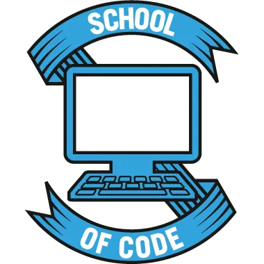

    

<h1 align="center">
  Web Fundamentals 2
</h1>

## Overview

This week, as well as building on our HTML and CSS skills, we will be focusing on what we make and why we make it. It sounds obvious, but user facing software should be built with the user in mind. What are they trying to do, how can you make that as easy as possible for them to achieve. Learning how to communicate information and design natural flowing interactions as well as having the technical skills to bring your ideas to life will set you apart from a lot of junior developers who become so consumed with the technology they are using that they forget the purpose they are trying to serve. The world does not need more software, it needs more useful software, and shorter sentences.

So for this week our focus will be practicing and mastering as much of the basics as possible so that we have the freedom to implement our user centered designs.

### This Weeks Objectives

- Build on our HTML and CSS skills.
- Tame Git so that it becomes a natural part of our workflow.
- Keep the user front and center in everything we make.
- Host our projects for the world to see!

## Learning Journey 🗺

The following tasks are for you to do in your own time, on your own and with your pair. They all will help you practice the skills necessary for this weeks objectives. Take your time, enjoy the process, and read around each part.

### HTML and CSS Next Steps 👣

Now that we are comfortable with what HTML and CSS do, it's time for us to embed our skills. Read through [this handbook](https://www.freecodecamp.org/news/the-html-handbook/) which will serve as a great reference for everything HTML. Follow the w3 schools [HTML](https://www.w3schools.com/html/default.asp) and [CSS](https://www.w3schools.com/css/default.asp) introductions.

The best way to really get these skills second nature is to practice little and often. Here are some ideas that might help you get started but feel free to build anything you like!

- Make yourself an HTML and CSS business card
- Recreate a web page (you've done google, try it with others!)
- Recreate a part of a web page (see a button you like, try and copy it exactly with HTML and CSS)
- Make a self portrait with CSS
- Recreate a famous painting with CSS
- Make up your own ideas!

### CSS: Flex Box 💪

Mastering layouts in CSS is a key skill of web design. There are many common layouts that you will see time and time again, but theres also room for creativity. Whether you're being super creating or implementing age old classic what you need is control over how your elements are laid out on the page. One way we could do this is to place all our elements at specific pixel positions on the page. The problem with this technique is that we don't know how big the screens of our users are. It could be Darren browsing on his 72 inch 4k smart tv, it could be Cindy on her smashed iPhone 5. It **could** be someone with exactly the same screen as you, but the point is we cant be sure.

There are a few options for how we overcome this problem. The old fashioned way is to use the table element that gives us a natural grid, you will see this on older sites and in HTML for email. Can can also use floats but the two main modern ways for layout out elements on a page are Flex box and Grid.

We will start this week by learning about Flex box. There are a few concepts to learn, after which you'll have the freedom to layout things in a powerful responsive way.

- There is a [great course here](https://flexbox.io/) that that will guide you through all things flex box.
- Once you've got the basics you can take a look at [this great reference article with diagrams](https://css-tricks.com/snippets/css/a-guide-to-flexbox/).
- To have a bit of fun and flex your skills play this game called [Flexbox Froggy](https://flexboxfroggy.com/).

Now that you can use flex box, have a go using it in some of your practices and use it in your checkpoint challenge!

### Naming Conventions

Ok so you've made a website. You add a page. You add another page. You add three more pages. You go back to try and change something on the first page and you get stuck. The codes a mess, it started small but has quickly spiraled out of control as you add this and that in a slap dash fashion. This is the natural way of this **if** you don't stick to a pattern (or convention) to help you write clean code. It's important to write clean code not just for your future self, but also for your colleagues and the person who has to maintain the code if you get hit by a bus. There is a saying in programming that you should always write code as if the person who next has to read it is a violent psychopath who knows where you live (or Tao some people call him).

We could come up with a convention ourselves, and this is not a bad idea as long as we stick to it. However, writing clean maintainable code is such a common problem that clever people have already put a lot of time, trial and error it creating good patterns so we can use that to our advantage.

**Introducing BEM 🧱🔥🛠**

BEM stands for Block Element Modifier, and is a naming convention to help us write nice clean HTML and CSS code. It's not super complicated, the hard part is maintaining discipline. Just remember, we know where you live.

Read through [this quick-start guide](https://en.bem.info/methodology/quick-start/) for an overview of what BEM is. Read more thoughts about BEM in [this css-tricks article](https://css-tricks.com/bem-101/) and then apply the BEM naming convention to your code. In the long run sticking to a pattern with save you **A LOT** of time and stress. Keep it clean folks!

### User Centered Design 🛠😳🛠

This week we are trying to keep the use front and center in our approach to designing and building web experiences. [This article and video](https://www.interaction-design.org/literature/topics/user-centered-design) gives a great introduction into what a user centered design process looks like. T[his old but good article](https://www.smashingmagazine.com/2008/01/10-principles-of-effective-web-design/) gives a more specific look at how users interact with web pages.

When working on your checkpoint challenge, use what you've learnt about user centered design in your approach.

### Design Fundamentals 📐

No matter how much CSS skill you have, if you don't know what you want the page to look like then your still stuck with bad looking pages. This is where design principles come into play. How much white space, the line spacing, the alignment of different block for example are all easy things to manipulate with CSS. Get these values right and your site and your site looks professional, get them wrong or don't bother thinking about it and your site looks amateur.

This [tutorial](https://scrimba.com/learn/design) does and excellent job of taking you through UI design fundamentals.

### Continuous Deployment ☁️👽

Now that we can build awesome websites, wouldn't it be good if the world could see it?

Netlify is a service that allows us to set up continuous deployment for our projects. This means that anytime we push changes to a GitHub repo, the site will update! Follow [this guide](https://www.netlify.com/blog/2016/10/27/a-step-by-step-guide-deploying-a-static-site-or-single-page-app/) to get your sites continuously deployed and hosted on [Netlify](https://www.netlify.com/).

## Groups and Pairs 👩‍💻👨‍💻 👩‍💻👨‍💻

Below you will find the pairs and teams for this week. Your pair will be the person you see the most but keep in touch with your team throughout the week. Ask them how they are getting on and use them as your first port of call if you are stuck on something.

Pairs for Week 1 and 2

| Pair | Team |                                   |
| ---- | ---- | --------------------------------- |
| 1    | 1    | Tom Walker & Gurmukh Chandan      |
| 2    | 1    | Rebecca Floyd & Sara Mohamoud     |
| 3    | 2    | Sellanni McKenzie & Jamie Hannah  |
| 4    | 2    | Amina Muhammad & Toby Smith       |
| 5    | 3    | Rumaanah Ellahi & Emilio Comiling |
| 6    | 3    | Lewis Murray & Catherine Butler   |
| 7    | 4    | Kate Harrison & Alina Savin       |
| 8    | 4    | Becks Maybury & Nancy Echefu      |
| 9    | 5    | Kelly Ryan & Muna Fidow           |
| 10   | 5    | Wiktor Nowicki & Merlin Jones     |
| 11   | 6    | Helena Archer & Jack Browne       |
| 12   | 6    | Maryam Dar & Yonis Elmi           |
| 13   | 7    | Clarisse Leduc & Jubair Ahmed     |
| 14   | 7    | Natalie Pinnock & Ines Perez      |
| 15   | 8    | Rachel Haynes & Umar Begg         |
| 16   | 8    | Asfand Khan & Amdadur Rahman      |
| 17   | 9    | Tania Yeromiyan & Jade Phipps     |
| 18   | 9    | Claudiu Manta & Shola Quadri      |
| 19   | 10   | Yasmin Mohamud & Jordan Linton    |
| 20   | 10   | Ryan Brown & Gemma Whitfield      |

### Checkpoint Challenge ✅
